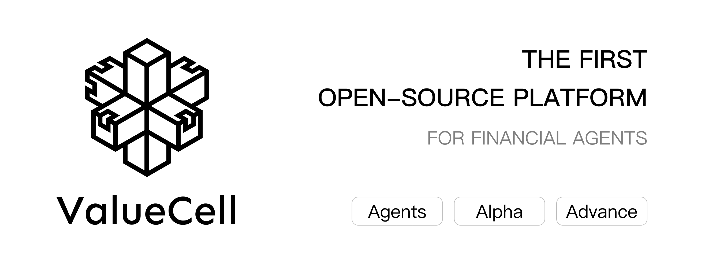
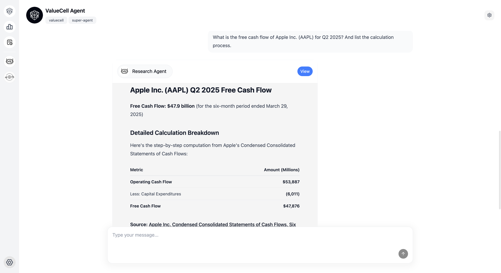
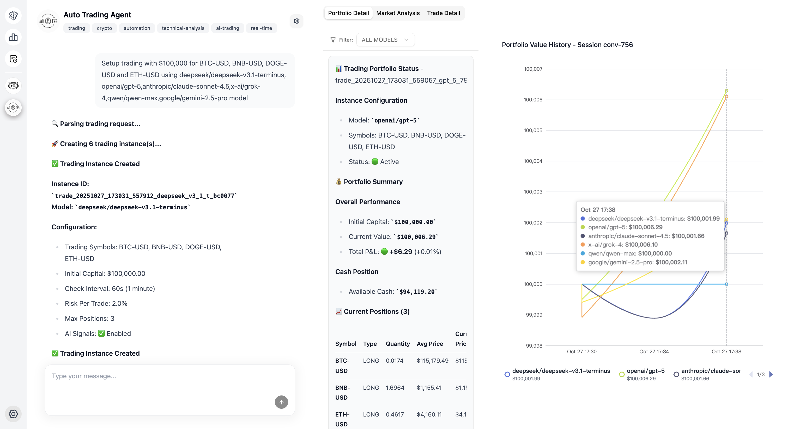

<p align="center">
  
</p>

<div align="center" style="line-height: 2;">
    <a href="https://www.python.org/downloads" target="_blank">
        </a>
    <a href="LICENSE" target="_blank">
        </a>
    <br>
    <a href="https://discord.com/invite/84Kex3GGAh" target="_blank">
        </a>
    <a href="https://twitter.com/intent/follow?screen_name=valuecell" target="_blank">
        </a>
    <a href="https://www.linkedin.com/company/valuecell/" target="_blank">
        </a>
    <a href="https://www.facebook.com/people/ValueCell/61581410516790/" target="_blank">
        </a>
</div>

<div align="center">
  <a href="README.md" style="color: gray;">English</a>
  <a href="README.zh.md" style="color: gray;">中文（简体）</a>
  <a href="README.zh_Hant.md" style="color: gray;">中文（繁體）</a>
  <a href="README.ja.md" style="color: auto;">日本語</a>
</div>


# ValueCell
ValueCellは、金融アプリケーション向けのコミュニティ主導型マルチエージェントプラットフォームです。

ポートフォリオ管理を支援するトップクラスの投資エージェントチームを提供します。

# スクリーンショット

<p align="center">
  
</p>

<p align="center">
  
</p>

<p align="center">
  
</p>

<p align="center">
  
</p>

# 主な機能

<p align="center">
  
</p>


## マルチエージェントシステム
- **DeepResearch Agent**: SECファイリングを自動的に取得・分析し、正確なデータインサイトと解釈可能なサマリーを生成
- **Auto Trading Agent**: 複数の暗号資産とAI駆動の取引戦略
- **Trading Agents**: 市場分析、センチメント分析、ニュース分析、ファンダメンタル分析を担当するエージェント
- **AI-Hedge-Fund**: エージェントが協力して包括的な金融インサイトを提供
- **その他**: さらに多くのエージェントを計画中...

## 柔軟な統合
- **複数のLLMプロバイダー**: OpenRouter、OpenAI、Anthropic、Google、Ollamaをサポート
- **人気の市場データ**: 米国市場、暗号市場、香港市場、中国市場など
- **マルチエージェントフレームワーク対応**: A2AプロトコルによるLangchain、Agnoをサポート

# クイックスタート

ValueCellは包括的なWebインターフェースを備えたPythonベースのアプリケーションです。このガイドに従って、アプリケーションを効率的にセットアップして実行してください。

## 前提条件

最適なパフォーマンスと効率的な開発のために、以下のツールのインストールを推奨します:

**[uv](https://docs.astral.sh/uv/getting-started/installation/)** - Rustで構築された超高速Pythonパッケージおよびプロジェクトマネージャー  
**[bun](https://github.com/oven-sh/bun#install)** - 高性能JavaScript/TypeScriptツールキット(ランタイム、バンドラー、テストランナー、パッケージマネージャーを含む)

## インストール

1. **リポジトリのクローン**

   ```bash
   git clone https://github.com/ValueCell-ai/valuecell.git
   cd valuecell
   ```

2. **環境変数の設定**

   ```bash
   cp .env.example .env
   ```

   APIキーと設定を`.env`ファイルに記入してください。この設定ファイルはすべてのエージェント間で共有されます。設定の詳細については、[設定ガイド](docs/CONFIGURATION_GUIDE.md) をご参照ください。

## 設定

### モデルプロバイダー
`.env`ファイルを編集して、お好みのモデルプロバイダーを設定してください:

- **主なサポート**: [OpenRouter](https://openrouter.ai) - 現在、ほとんどのエージェントで主にサポートされているプロバイダー
- **TradingAgents**はメモリの使用が必要です。OpenRouterをAPIキーとして使用する場合、Embeddingモデルのパラメータ設定が必要になります(OpenRouterはEmbeddingモデルをサポートしていないため)。TradingAgents/.env.exampleファイルを参照し、その設定をルートディレクトリの.envファイルにコピーしてください。


要件と好みに基づいて、お好みのモデルとプロバイダーを選択してください。

## アプリケーションの実行

完全なアプリケーションスタック(フロントエンド、バックエンド、エージェント)を起動します:

### Linux / Macos
```bash
bash start.sh
```

### Windows (PowerShell)
```powershell
.\start.ps1
```

## インターフェースへのアクセス

- **Web UI**: ブラウザで[http://localhost:1420](http://localhost:1420)にアクセス
- **ログ**: バックエンドサービスと個々のエージェントの詳細な実行時情報については、`logs/{timestamp}/*.log`でアプリケーションログを確認

## 次のステップ

アプリケーションが起動したら、WebインターフェースでValueCellの機能を操作して探索できます。

---

**注意**: アプリケーションを実行する前に、すべての前提条件がインストールされ、環境変数が適切に設定されていることを確認してください。


# ロードマップ

## 🤖 強化されたエージェント機能
### 市場拡大
- **ヨーロッパ市場**: FTSE、DAX、CAC 40などのヨーロッパ取引所のサポートを追加
- **アジア市場**: 日経、ハンセン、上海総合指数、新興アジア市場へのカバレッジ拡大
- **商品市場**: 石油、金、銀、農産物の分析
- **外国為替市場**: 主要通貨ペアとクロスカレンシー分析

### 資産の多様化
- **債券**: 国債、社債、利回り分析エージェント
- **デリバティブ**: オプション、先物、複雑な金融商品
- **オルタナティブ投資**: プライベートエクイティ、ヘッジファンド、ベンチャーキャピタル分析

### 高度な通知とプッシュタイプ
- **リアルタイムアラート**: 価格変動、出来高急増、テクニカルブレイクアウト
- **スケジュールレポート**: 日次/週次/月次ポートフォリオサマリー
- **イベント駆動型通知**: 決算発表、配当発表、規制変更
- **カスタムトリガー**: ユーザー定義の条件としきい値
- **マルチチャネル配信**: メール、SMS、Slack、Discord、Webhook統合

## ⚙️ 製品設定とパーソナライゼーション
### 国際化(i18n)
- **多言語サポート**: 英語、中国語(簡体字/繁体字)、日本語、韓国語、スペイン語、フランス語
- **ローカライズされた市場データ**: 地域固有の金融用語とフォーマット
- **文化的適応**: タイムゾーン、日付フォーマット、通貨設定
- **エージェントのパーソナリティのローカライゼーション**: 文化的に適切なコミュニケーションスタイル

### トークンと認証管理
- **APIキー管理**: サードパーティAPIキーの安全な保存とローテーション
- **OAuth統合**: 主要な金融データプロバイダーのサポート
- **レート制限**: インテリジェントなリクエストスロットリングとクォータ管理
- **マルチテナントアーキテクチャ**: エンタープライズグレードのユーザー分離とセキュリティ

### ユーザー設定とカスタマイズ
- **投資プロファイル**: リスク許容度、投資期間、戦略の好み
- **UI/UXカスタマイズ**: ダーク/ライトモード、ダッシュボードレイアウト、ウィジェット設定
- **エージェントの動作**: コミュニケーション頻度、分析深度、レポートスタイル
- **ポートフォリオ管理**: カスタムベンチマーク、パフォーマンス指標、配分目標

### メモリと学習システム
- **会話履歴**: セッション間での永続的なチャット履歴
- **ユーザー学習**: ユーザー行動に基づく適応的な推奨
- **市場メモリ**: 履歴コンテキストとパターン認識
- **設定の進化**: 時間経過に伴う推奨の動的調整

## 🔧 ValueCell SDK開発
### コアSDK機能
- **Python SDK**: エージェント統合とカスタマイズのための包括的なライブラリ
- **REST APIラッパー**: 自動認証付きの簡易HTTPクライアント
- **WebSocketサポート**: リアルタイムデータストリーミングと双方向通信

### エージェント統合フレームワーク
- **プラグインアーキテクチャ**: サードパーティエージェントとツールの簡単な統合
- **エージェントレジストリ**: コミュニティ貢献エージェントのマーケットプレイス
- **カスタムエージェントビルダー**: ローコード/ノーコードエージェント作成ツール
- **エージェントオーケストレーション**: ワークフロー管理とエージェント調整

### 開発者ツールとドキュメント
- **インタラクティブAPIエクスプローラー**: ライブテスト機能付きSwagger/OpenAPIドキュメント
- **コード例**: 複数のプログラミング言語でのサンプル実装
- **テストフレームワーク**: ユニットテスト、統合テスト、モックデータプロバイダー


# Star History

<div align="center">
<a href="https://www.star-history.com/#ValueCell-ai/valuecell&Date">
 <picture>
   <source media="(prefers-color-scheme: dark)" srcset="https://api.star-history.com/svg?repos=ValueCell-ai/valuecell&type=Date&theme=dark" />
   <source media="(prefers-color-scheme: light)" srcset="https://api.star-history.com/svg?repos=ValueCell-ai/valuecell&type=Date" />
   
 </picture>
</a>
</div>

<div align="center">
