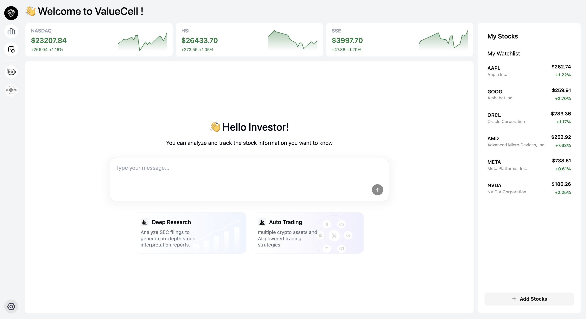

<p align="center">
  
</p>

<div align="center" style="line-height: 2;">
    <a href="https://www.python.org/downloads" target="_blank">
        </a>
    <a href="LICENSE" target="_blank">
        </a>  
    <br>
    <a href="https://discord.com/invite/84Kex3GGAh" target="_blank">
        </a>
    <a href="https://twitter.com/intent/follow?screen_name=valuecell" target="_blank">
        </a>
    <a href="https://www.linkedin.com/company/valuecell/" target="_blank">
        </a>
    <a href="https://www.facebook.com/people/ValueCell/61581410516790/" target="_blank">
        </a>
</div>

<div align="center">
  <a href="README.md" style="color: gray;">English</a>
  <a href="README.zh.md" style="color: gray;">中文（简体）</a>
  <a href="README.zh_Hant.md" style="color: auto;">中文（繁體）</a>
</div>


# ValueCell
ValueCell is a community-driven, multi-agent platform for financial applications.

It provides a team of TOP investment Agents to help manage your portfolio.

# Screenshot

<p align="center">
  
</p>

<p align="center">
  
</p>

# Key Features

<p align="center">
  
</p>


## Multi-Agent System
- **Trading Agents**: Agents work for market analysis, sentiment analysis, news analysis, and fundamentals analysis 
- **AI-Hedge-Fund**: Agents collaborate to provide comprehensive financial insights
- **SEC Agent**: Provides real-time updates from SEC 
- **Others**: More agents are in planning...

## Flexible Integrations
- **Multiple LLM Providers**: Support OpenRouter, OpenAI, Anthropic, Google and Ollama 
- **Popular Market Data**: Cover US market, Crypto market, Hong Kong market, China market and more
- **Multi-Agent Framework Compatible**: Support Langchain, Agno by A2A Protocol

# Quick Start

ValueCell is a Python-based application featuring a comprehensive web interface. Follow this guide to set up and run the application efficiently.

## Prerequisites

For optimal performance and streamlined development, we recommend installing the following tools:

**[uv](https://docs.astral.sh/uv/getting-started/installation/)** - Ultra-fast Python package and project manager built in Rust  
**[bun](https://github.com/oven-sh/bun#install)** - High-performance JavaScript/TypeScript toolkit with runtime, bundler, test runner, and package manager

## Installation

1. **Clone the repository**

   ```bash
   git clone https://github.com/ValueCell-ai/valuecell.git
   cd valuecell
   ```

2. **Configure environment variables**

   ```bash
   cp .env.example .env
   ```
   
   Edit the `.env` file with your API keys and preferences. This configuration file is shared across all agents.

## Configuration

### Model Providers
Configure your preferred model providers by editing the ⁠`.env` file:

- **Primary Support**: [OpenRouter](https://openrouter.ai) - Currently the main supported provider for most agents
- **TradingAgents** requires the use of Memory. If you use OpenRouter as API key, configuring the Embedding model parameters will be needed (since OpenRouter does not support Embedding models). Please refer to the TradingAgents/.env.example file and copy its configuration into the .env file located in the root directory.
  

Choose your preferred models and providers based on your requirements and preferences.

## Running the Application

Launch the complete application stack (frontend, backend, and agents):

### Linux / Macos
```bash
bash start.sh
```

### Windows (PowerShell)
```powershell
.\start.ps1
```

## Accessing the Interface

- **Web UI**: Navigate to [http://localhost:1420](http://localhost:1420) in your browser
- **Logs**: Monitor application logs at `logs/{timestamp}/*.log` for detailed runtime information of backend services and individual agents

## Next Steps

Once the application is running, you can explore the web interface to interact with ValueCell's features and capabilities.

---

**Note**: Ensure all prerequisites are installed and environment variables are properly configured before running the application.


# Roadmap

## 🤖 Enhanced Agent Capabilities
### Market Expansion
- **European Markets**: Add support for FTSE, DAX, CAC 40, and other European exchanges
- **Asian Markets**: Expand coverage to Nikkei, Hang Seng, Shanghai Composite, and emerging Asian markets
- **Commodity Markets**: Oil, Gold, Silver, Agricultural products analysis
- **Forex Markets**: Major currency pairs and cross-currency analysis

### Asset Diversification
- **Fixed Income**: Government bonds, corporate bonds, and yield analysis agents
- **Derivatives**: Options, futures, and complex financial instruments
- **Alternative Investments**: Private equity, hedge funds, and venture capital analysis

### Advanced Notification & Push Types
- **Real-time Alerts**: Price movements, volume spikes, and technical breakouts
- **Scheduled Reports**: Daily/weekly/monthly portfolio summaries
- **Event-driven Notifications**: Earnings releases, dividend announcements, regulatory changes
- **Custom Triggers**: User-defined conditions and thresholds
- **Multi-channel Delivery**: Email, SMS, Slack, Discord, and webhook integrations

## ⚙️ Product Configuration & Personalization
### Internationalization (i18n)
- **Multi-language Support**: English, Chinese (Simplified/Traditional), Japanese, Korean, Spanish, French
- **Localized Market Data**: Region-specific financial terminology and formats
- **Cultural Adaptation**: Time zones, date formats, and currency preferences
- **Agent Personality Localization**: Culturally appropriate communication styles

### Token & Authentication Management
- **API Key Management**: Secure storage and rotation of third-party API keys
- **OAuth Integration**: Support for major financial data providers
- **Rate Limiting**: Intelligent request throttling and quota management
- **Multi-tenant Architecture**: Enterprise-grade user isolation and security

### User Preferences & Customization
- **Investment Profile**: Risk tolerance, investment horizon, and strategy preferences
- **UI/UX Customization**: Dark/light mode, dashboard layouts, and widget preferences
- **Agent Behavior**: Communication frequency, analysis depth, and reporting style
- **Portfolio Management**: Custom benchmarks, performance metrics, and allocation targets

### Memory & Learning Systems
- **Conversation History**: Persistent chat history across sessions
- **User Learning**: Adaptive recommendations based on user behavior
- **Market Memory**: Historical context and pattern recognition
- **Preference Evolution**: Dynamic adjustment of recommendations over time

## 🔧 ValueCell SDK Development
### Core SDK Features
- **Python SDK**: Comprehensive library for agent integration and customization
- **REST API Wrapper**: Simplified HTTP client with automatic authentication
- **WebSocket Support**: Real-time data streaming and bidirectional communication

### Agent Integration Framework
- **Plugin Architecture**: Easy integration of third-party agents and tools
- **Agent Registry**: Marketplace for community-contributed agents
- **Custom Agent Builder**: Low-code/no-code agent creation tools
- **Agent Orchestration**: Workflow management and agent coordination

### Developer Tools & Documentation
- **Interactive API Explorer**: Swagger/OpenAPI documentation with live testing
- **Code Examples**: Sample implementations in multiple programming languages
- **Testing Framework**: Unit tests, integration tests, and mock data providers


# Star History

<div align="center">
<a href="https://www.star-history.com/#ValueCell-ai/valuecell&Date">
 <picture>
   <source media="(prefers-color-scheme: dark)" srcset="https://api.star-history.com/svg?repos=ValueCell-ai/valuecell&type=Date&theme=dark" />
   <source media="(prefers-color-scheme: light)" srcset="https://api.star-history.com/svg?repos=ValueCell-ai/valuecell&type=Date" />
   
 </picture>
</a>
</div>

<div align="center">