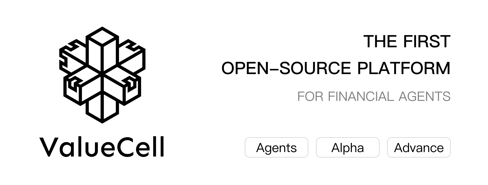
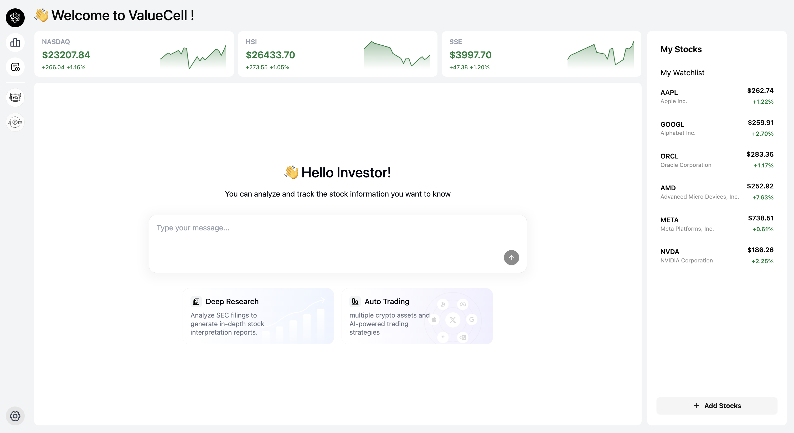
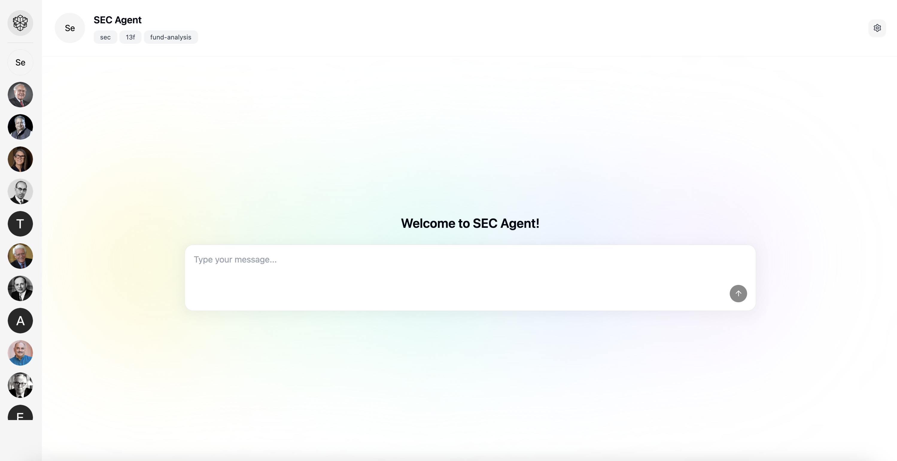

<p align="center">
  
</p>

<div align="center" style="line-height: 2;">
    <a href="https://www.python.org/downloads" target="_blank">
        </a>
    <a href=".LICENSE" target="_blank">
        </a>  
    <br>
    <a href="https://discord.com/invite/84Kex3GGAh" target="_blank">
        </a>
    <a href="https://twitter.com/intent/follow?screen_name=valuecell" target="_blank">
        </a>
    <a href="https://www.linkedin.com/company/langgenius/" target="_blank">
        </a>
    <a href="https://www.facebook.com/people/ValueCell/61581410516790/" target="_blank">
        </a>
</div>

<div align="center">
  <a href="README.md" style="color: auto;">English</a>
  <a href="README.zh.md" style="color: gray;">中文</a>
</div>


# ValueCell
ValueCell 是一个社区驱动的多智能体金融应用平台。

它将为您提供顶级的投资智能体团队，帮助您管理投资组合。

# 产品截图

<p align="center">
  
</p>

<p align="center">
  
</p>

# 核心特性

## 多智能体系统
- **Trading Agents**：专门负责市场分析、情绪分析、新闻分析和基本面分析的智能体协同工作
- **AI-Hedge-Fund**：智能体协作提供全面的金融洞察
- **SEC Agent**：提供来自SEC的实时的推送更新
- **其他智能体**：更多智能体正在规划中...

## 灵活集成
- **多种大语言模型提供商**：支持 OpenRouter、OpenAI、Anthropic、Google 和 Ollama
- **热门市场数据**：覆盖美国市场、加密货币市场、香港市场、中国市场等
- **多智能体框架兼容**：通过 A2A 协议，支持 Langchain、Agno 等主流Agent框架

# 快速开始

ValueCell 是一个基于Python的应用程序，且有完备的前端操作页面。可以参考下面配置快速运行。

## 前提条件

为了获得最佳性能和简化开发，我们建议安装以下工具：

**[uv](https://docs.astral.sh/uv/getting-started/installation/)** - 用Rust构建的超快速Python包和项目管理器  
**[bun](https://github.com/oven-sh/bun#install)** - 高性能JavaScript/TypeScript工具包，集成运行时、打包器、测试运行器和包管理器

## 安装

1. **克隆仓库**

   ```bash
   git clone https://github.com/ValueCell-ai/valuecell.git
   cd valuecell
   ```

2. **配置环境变量**

   ```bash
   cp .env.example .env
   ```
   
   使用您的API密钥和偏好设置编辑`.env`文件。此配置文件在所有智能体之间共享。

## 配置

### 模型提供商
通过编辑`.env`文件配置您首选的模型提供商：

- **主要支持**：[OpenRouter](https://openrouter.ai) - 目前大多数智能体的主要支持提供商
- **TradingAgents** 集成了Memory功能。如果您使用OpenRouter作为API密钥，需要配置嵌入模型参数（因为OpenRouter不支持嵌入模型）。请参考TradingAgents/.env.example文件，并将其配置复制到根目录的.env文件中。
  

根据您的需求和使用模式选择首选的模型和提供商。

## 运行应用程序

启动完整的应用程序堆栈（前端、后端和智能体）：

```bash
bash start.sh
```

## 访问界面

- **Web UI**：在浏览器中导航到 [http://localhost:1420](http://localhost:1420)
- **日志**：在 `logs/{timestamp}/*.log` 监控应用程序日志，获取后端服务和各个智能体的详细运行时信息

## 最后

应用程序运行后，您可以通过Web界面使用ValueCell中集成的Agents。

---

**注意**：运行应用程序前，请确保所有前提条件已安装且环境变量已正确配置。


# Roadmap

## 🤖 增强智能体能力
### 市场扩展
- **欧洲市场**：增加对富时指数、DAX、CAC 40和其他欧洲交易所的支持
- **亚洲市场**：扩展对日经指数、恒生指数、上证综指和新兴亚洲市场的覆盖
- **大宗商品市场**：石油、黄金、白银、农产品分析
- **外汇市场**：主要货币对和交叉货币分析

### 资产类别多样化
- **固定收益**：政府债券、企业债券和收益率分析智能体
- **衍生品**：期权、期货和复杂金融工具
- **另类投资**：私募股权、对冲基金和风险投资分析

### 高级通知和推送类型
- **实时警报**：价格变动、成交量激增和技术突破
- **定期报告**：每日/每周/每月投资组合摘要
- **事件驱动通知**：财报发布、股息公告、监管变化
- **自定义触发器**：用户定义的条件和阈值
- **多渠道推送**：邮件、短信、Slack、Discord和webhook集成

## ⚙️ 产品配置与个性化
### 国际化 (i18n)
- **多语言支持**：英语、中文（简体/繁体）、日语、韩语、西班牙语、法语
- **本地化市场数据**：特定地区的金融术语和格式
- **文化适应**：时区、日期格式和货币偏好
- **智能体个性本地化**：文化适宜的沟通风格

### 令牌和身份验证管理
- **API密钥管理**：第三方API密钥的安全存储和轮换
- **OAuth集成**：支持主要金融数据提供商
- **速率限制**：智能请求节流和配额管理
- **多租户架构**：企业级用户隔离和安全

### 用户偏好和自定义
- **投资档案**：风险承受能力、投资期限和策略偏好
- **UI/UX自定义**：深色/浅色模式、仪表板布局和小部件偏好
- **智能体行为**：沟通频率、分析深度和报告风格
- **投资组合管理**：自定义基准、绩效指标和配置目标

### 记忆和学习系统
- **对话历史**：跨会话的持久聊天历史
- **用户学习**：基于用户行为的自适应推荐
- **市场记忆**：历史背景和模式识别
- **偏好演进**：推荐的动态调整

## 🔧 ValueCell SDK开发
### 核心SDK功能
- **Python SDK**：用于智能体集成和自定义的核心代码，衔接前后端
- **REST API包装器**：具有自动身份验证的简化HTTP客户端
- **WebSocket支持**：实时数据流和双向通信

### 智能体集成框架
- **插件架构**：轻松集成第三方智能体和工具
- **智能体注册表**：社区贡献智能体的市场
- **自定义智能体构建器**：低代码/无代码智能体创建工具
- **智能体编排**：工作流管理和智能体协调

### 开发者工具和文档
- **交互式API浏览器**：带有实时测试的Swagger/OpenAPI文档
- **代码示例**：多种编程语言的示例实现
- **测试框架**：单元测试、集成测试和模拟数据提供商


# Star

<div align="center">
<a href="https://www.star-history.com/#ValueCell-ai/valuecell&Date">
 <picture>
   <source media="(prefers-color-scheme: dark)" srcset="https://api.star-history.com/svg?repos=ValueCell-ai/valuecell&type=Date&theme=dark" />
   <source media="(prefers-color-scheme: light)" srcset="https://api.star-history.com/svg?repos=ValueCell-ai/valuecell&type=Date" />
   
 </picture>
</a>
</div>

<div align="center">