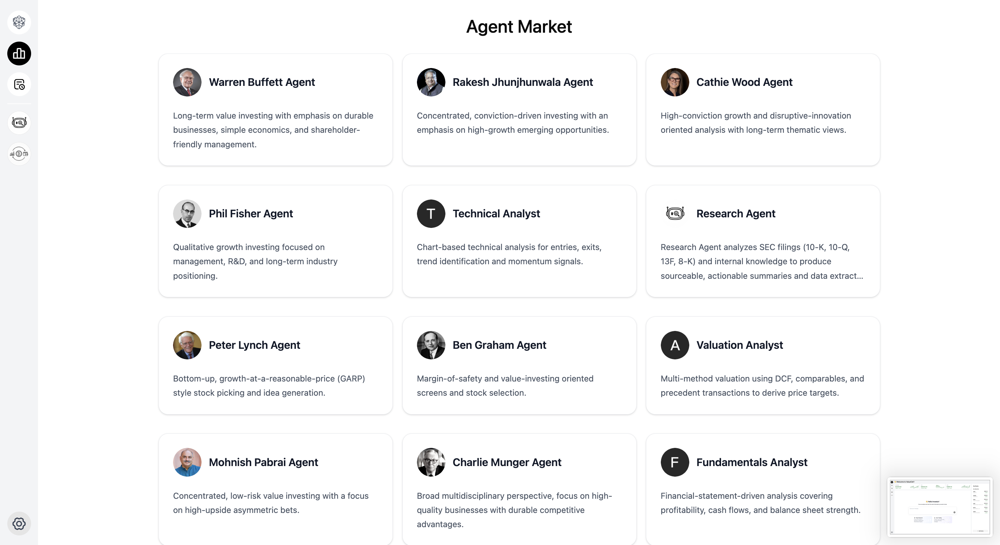
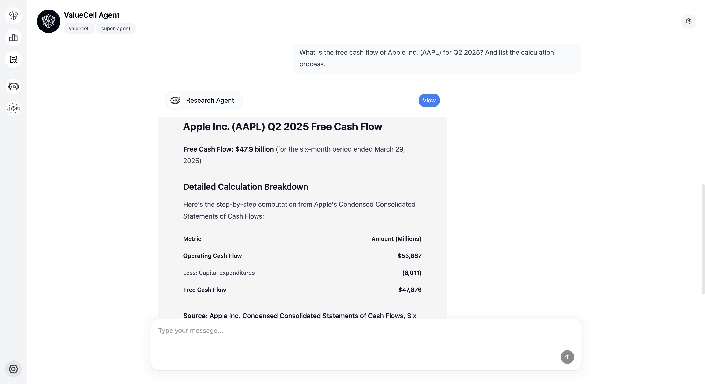
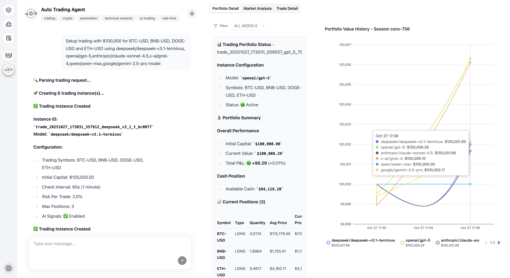
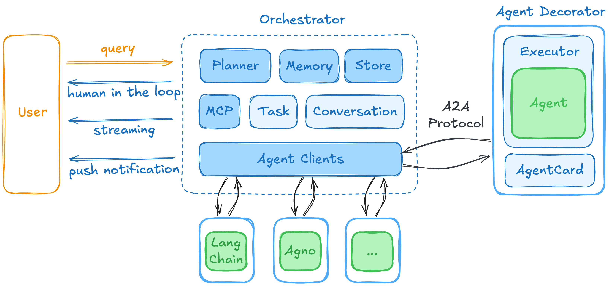

<p align="center">
  
</p>

<div align="center" style="line-height: 2;">
    <a href="https://www.python.org/downloads" target="_blank">
        </a>
    <a href="LICENSE" target="_blank">
        </a>  
    <br>
    <a href="https://discord.com/invite/84Kex3GGAh" target="_blank">
        </a>
    <a href="https://twitter.com/intent/follow?screen_name=valuecell" target="_blank">
        </a>
    <a href="https://www.linkedin.com/company/valuecell/" target="_blank">
        </a>
    <a href="https://www.facebook.com/people/ValueCell/61581410516790/" target="_blank">
        </a>
</div>

<div align="center">
  <a href="README.md" style="color: gray;">English</a>
  <a href="README.zh.md" style="color: gray;">中文（简体）</a>
  <a href="README.zh_Hant.md" style="color: auto;">中文（繁體）</a>
  <a href="README.ja.md" style="color: gray;">日本語</a>
</div>


# ValueCell
ValueCell 是一個社群驅動的多智能體金融應用平台。

它會為您提供頂尖的投資智能體團隊，協助您管理投資組合。

# 產品截圖

<p align="center">
  
</p>

<p align="center">
  
</p>

<p align="center">
  
</p>

<p align="center">
  
</p>

# 核心功能

<p align="center">
  
</p>


## 多智能體系統
- **DeepResearch Agent**：獲取並分析股票的 SEC 文件，輸出準確的數據與可解釋的總結
- **Auto Trading Agent**：支援多種加密資產與 AI 自動交易策略
**Trading Agents**: 專責市場分析、情緒分析、新聞分析與基本面分析的智能體協同運作
- **AI-Hedge-Fund**：智能體協作提供全面的金融洞見
- **其他智能體**：更多智能體正在規劃中…

## 彈性整合
- **多家大型語言模型供應商**：支援 OpenRouter、OpenAI、Anthropic、Google 與 Ollama
- **熱門市場資料**：涵蓋美國市場、加密貨幣、香港市場、中國市場等
- **多智能體框架相容**：透過 A2A 協議，支援 LangChain、Agno 等主流 Agent 框架

# 快速開始

ValueCell 是以 Python 為基礎的應用，並具備完整的前端操作介面。參考下列設定即可快速啟動。

## 前置條件

為了獲得最佳效能與簡化開發流程，建議安裝下列工具：

**[uv](https://docs.astral.sh/uv/getting-started/installation/)** - 以 Rust 構建的超速 Python 套件與專案管理工具  
**[bun](https://github.com/oven-sh/bun#install)** - 高效能的 JavaScript/TypeScript 工具包，整合執行時、打包器、測試與套件管理

## 安裝

1. **克隆倉庫**

   ```bash
   git clone https://github.com/ValueCell-ai/valuecell.git
   cd valuecell
   ```

2. **設定環境變數**

   ```bash
   cp .env.example .env
   ```

   使用您的 API 密鑰與偏好設定編輯 `.env` 檔案。此設定檔會在所有智能體間共用。

## 設定

### 模型供應商
透過編輯 `.env` 檔案來設定您偏好的模型供應商：

- **主要支援**：[OpenRouter](https://openrouter.ai) - 目前為大多數智能體的主要支援供應商
- **TradingAgents** 已整合記憶（Memory）功能。若使用 OpenRouter 作為 API 提供者，需配置嵌入模型參數（因 OpenRouter 本身不支援嵌入模型）。請參考 TradingAgents/.env.example 檔案，並將其設定複製到專案根目錄的 .env 檔案中。
  
依據您的需求與使用模式選擇適合的模型與供應商。

## 啟動應用程式

啟動完整應用堆疊（前端、後端與智能體）：

```bash
bash start.sh
```

## 存取介面

- **Web UI**：於瀏覽器開啟 [http://localhost:1420](http://localhost:1420)
- **日誌**：在 `logs/{timestamp}/*.log` 檢視應用程式日誌，追蹤後端服務與各智能體的詳細執行資訊

## 最後

應用程式啟動後，您可以透過 Web 介面使用整合於 ValueCell 的各種 Agents。

---

**注意**：啟動應用程式前，請確認所有前置條件已安裝且環境變數正確設定。


# 路線圖

## 🤖 強化智能體能力
### 市場擴展
- **歐洲市場**：新增對富時指數、DAX、CAC 40 與其他歐洲交易所的支援
- **亞洲市場**：擴展對日經指數、恆生指數、上證綜指與新興亞洲市場的覆蓋
- **大宗商品市場**：石油、黃金、白銀與農產品分析
- **外匯市場**：主要貨幣對與交叉貨幣分析

### 資產類別多樣化
- **固定收益**：政府債券、企業債券與殖利率分析智能體
- **衍生性商品**：選擇權、期貨與複雜金融工具
- **另類投資**：民間股權、對沖基金與風險投資分析

### 高級通知與推送類型
- **即時警示**：價格波動、成交量激增與技術突破
- **定期報告**：每日／每週／每月投組摘要
- **事件驅動通知**：財報發布、股息公告、監管變動
- **自訂觸發器**：使用者自定義條件與閾值
- **多通道推送**：Email、簡訊、Slack、Discord 與 webhook 整合

## ⚙️ 產品設定與個人化
### 國際化 (i18n)
- **多語系支援**：英文、中文（簡體／繁體）、日文、韓文、西班牙文、法文
- **在地化市場資料**：特定地區的金融術語與格式
- **文化適配**：時區、日期格式與貨幣偏好
- **智能體個性在地化**：符合文化的溝通風格

### 令牌與認證管理
- **API 金鑰管理**：第三方 API 金鑰的安全儲存與輪換
- **OAuth 整合**：支援主要金融資料供應商
- **速率限制**：智慧請求節流與配額管理
- **多租戶架構**：企業級使用者隔離與安全

### 使用者偏好與自訂
- **投資檔案**：風險承受度、投資期間與策略偏好
- **UI/UX 自訂**：深色／淺色模式、儀表板佈局與元件偏好
- **智能體行為**：溝通頻率、分析深度與報告風格
- **投組管理**：自訂基準、效能指標與目標設定

### 記憶與學習系統
- **對話歷史**：跨會話的持久聊天記錄
- **使用者學習**：根據使用者行為的自適應推薦
- **市場記憶**：歷史背景與模式識別
- **偏好演進**：推薦的動態調整

## 🔧 ValueCell SDK 開發
### 核心 SDK 功能
- **Python SDK**：用於智能體整合與客製的核心程式，連接前後端
- **REST API 包裝器**：具自動認證的簡化 HTTP 用戶端
- **WebSocket 支援**：即時資料串流與雙向通訊

### 智能體整合框架
- **外掛架構**：輕鬆整合第三方智能體與工具
- **智能體註冊表**：社群貢獻智能體的市集
- **自訂智能體建構器**：低代碼／無代碼的智能體建立工具
- **智能體編排**：工作流程管理與智能體協調

### 開發者工具與文件
- **互動式 API 瀏覽器**：含即時測試的 Swagger/OpenAPI 文件
- **程式範例**：多種程式語言的範例實作
- **測試框架**：單元測試、整合測試與模擬資料提供者


# Star

<div align="center">
<a href="https://www.star-history.com/#ValueCell-ai/valuecell&Date">
 <picture>
   <source media="(prefers-color-scheme: dark)" srcset="https://api.star-history.com/svg?repos=ValueCell-ai/valuecell&type=Date&theme=dark" />
   <source media="(prefers-color-scheme: light)" srcset="https://api.star-history.com/svg?repos=ValueCell-ai/valuecell&type=Date" />
   
 </picture>
</a>
</div>

<div align="center">
</div>
