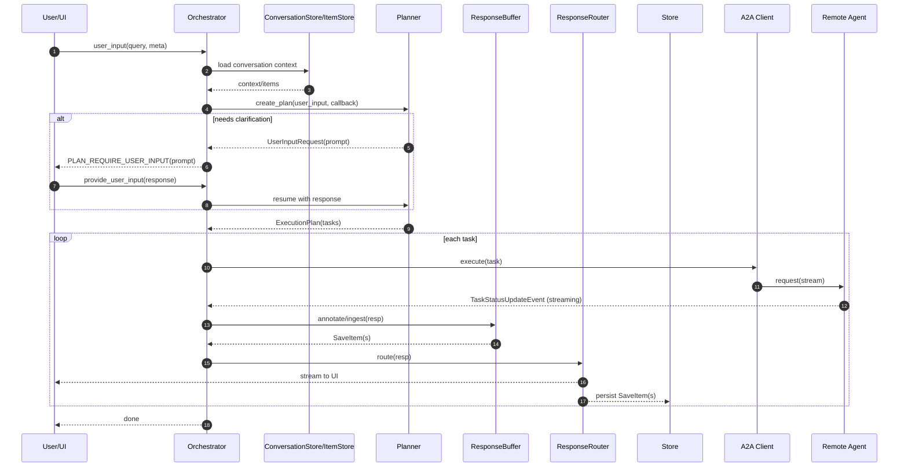

# ValueCell Core Architecture

This document explains how the modules under `valuecell/core/` collaborate at runtime.

## Highlights

- Async, re-entrant orchestrator: `process_user_input` is a streaming async entrypoint that can pause for HITL and resume safely.
- Planner with HITL: pauses on missing info/risky steps via `UserInputRequest` (asyncio.Event), resumes after user feedback to produce an adequate plan.
- Streaming pipeline: `Response` → `ResponseBuffer` (buffered vs immediate) → `ResponseRouter` to UI and Store, with stable item IDs for partial aggregation.
- Agent2Agent (A2A) integration: tasks call remote agents via `a2a-sdk`; status events drive routing; agents can be wrapped by lightweight decorators/servers.
- Conversation memory: in-memory/SQLite stores enable reproducible history, fast "resume from last", and auditability.
- Robustness: typed errors, side-effects (e.g., fail task) from router, and room for retry/backoff policies where appropriate.

## High-level flow

The orchestration loop ingests a user input, plans next steps, optionally requests human input to resolve ambiguity, and then executes tasks via remote agents (Agent2Agent, A2A). Responses stream back incrementally and are routed to the appropriate sinks (UI, logs, stores).

```mermaid
flowchart TD
  U[User Input] --> O[process_user_input (Orchestrator)]
  O -->|analyze input + context| P[Planner]
  P -->|adequate plan| PL[Plan]
  P -->|needs clarification| HITL[HITL: clarification / approval]
  HITL --> UI[UI / Operator]
  UI -->|feedback| P
  PL --> T[Tasks]
  T --> A2A[A2A calls]
  A2A --> RA[Remote Agents]
  RA --> SR[Streamed Responses]
  SR --> RB[ResponseBuffer]
  RB --> RR[ResponseRouter]
  RR --> UI
  RR --> ST[Store]
```

### Sequence: async and reentrancy



## Orchestrator: process_user_input

The orchestrator entrypoint (conceptually `process_user_input`) receives a user message (plus context IDs) and coordinates the entire lifecycle:

1. Delegate to the Planner to derive an actionable plan
2. If the plan needs confirmation or extra parameters, trigger Human-in-the-Loop (HITL)
3. Execute the plan as one or more tasks
4. Stream partial responses while executing
5. Persist results and emit final responses

The orchestrator is async and re-entrant:

- All I/O boundaries (`await`) are explicit to support concurrency
- If a human confirmation is required, the orchestrator can pause, surface a checkpoint, and resume later when feedback arrives
- Reentrancy is supported by idempotent response buffering and conversation state: resuming continues from the last acknowledged step

### Streaming model

Responses are produced incrementally while tasks execute:

- `Response` represents typed chunks (tokens, tool results, notifications)
- `ResponseBuffer` accumulates and aggregates partials into stable snapshots
- `ResponseRouter` fans out to multiple sinks (UI streams, logs, stores)

This allows the UI to render partial progress while long-running steps (such as remote agent calls) are still in flight.

## Planner: intent → plan (with HITL)

The Planner turns a natural-language user input into an executable plan. Its responsibilities include:

- Interpreting the user’s goal and available agent capabilities
- Identifying missing parameters and ambiguities
- Producing a typed plan describing the steps and tool/agent calls

Human-in-the-loop is integrated into planning:

- When the planner detects insufficient information or risky actions, it emits a “clarification/approval” checkpoint
- The orchestrator surfaces that checkpoint via the router to the UI/user
- Once the user adds information or approves the step, the orchestrator resumes with an updated plan context

Under the hood:

- `planner.py` encapsulates the decision logic
- `planner_prompts.py` centralizes prompt templates (when LLM-based planning is used)
- `coordinate/models.py` defines plan/step data models used by both planner and orchestrator

## Task execution

After planning, the orchestrator executes each task. A task is an atomic unit that typically invokes a remote agent to perform work.

Execution characteristics:

- Tasks are awaited asynchronously; independent tasks may run concurrently when safe
- Each task emits structured responses (tool results, logs, progress) as it runs
- Failures are converted into typed errors and can trigger retries or compensating steps (policy-dependent)

The conversation and item stores record inputs/outputs for reproducibility and auditing.

## A2A integration: talking to remote agents

Each task uses the Agent2Agent (A2A) protocol to interact with remote agents:

- Request/response schemas are defined by the agent capability “cards” and message models
- The local runtime uses `a2a-sdk` to send/receive over the selected transport (HTTP or others)
- Streaming results are fed into `ResponseBuffer` and routed live to clients

This protocol boundary makes agents location-transparent: they can run locally, remotely, or be swapped without changing the orchestrator.

## Agent implementation: decorators and wiring

Remote agents can be embedded with a very small footprint using the core agent decorator and wiring utilities:

- `agent/decorator.py` wraps a plain async function into a fully-typed agent handler
- `agent/connect.py` wires the decorated function into the runtime (registration, routing)
- `agent/card.py` describes capabilities, inputs, and outputs so the planner can select it

The planner can select this capability when it fits the user’s goal, and the orchestrator will route a task through A2A to execute it.

## Conversation and memory

`conversation_store.py` and `item_store.py` abstract conversation history and per-item storage:

- In-memory and SQLite backends are available
- Filtering and pagination support efficient context retrieval
- Latest items can be fetched for fast “resume from last” behaviors

This memory layer underpins reentrancy and auditability.

## Async & reentrancy details

- All external calls (planning, remote agents, storage) are awaited
- `ResponseBuffer` enables idempotent aggregation of partial output so a resumed session can safely replay or continue
- Orchestrator checkpoints (HITL) are modeled as explicit yield points; upon resumption, the same context IDs lead the flow to continue from the next step
- Backpressure: routers can apply flow control when sinks are slow

## Error handling & resilience

Typical edge cases and policies:

- Missing parameters → HITL clarification
- Planner errors → structured failure with user-facing guidance
- Agent timeouts → retry/backoff policies; partial results remain in the buffer
- Transport errors → surfaced via typed exceptions; orchestration may retry or abort
- Consistency → conversation records ensure inputs/outputs are durable

## Extensibility

- Add a new agent: create a capability card, implement a decorated async handler, register/connect it
- Add a new store: implement the `ItemStore`/`ConversationStore` interfaces
- Add a new transport: integrate a compatible adapter and update the A2A client wiring
- Customize planning: extend planner prompts/logic and enrich plan models

---

In short, the orchestrator coordinates an async, re-entrant loop of plan → execute → stream, with human checkpoints where appropriate. Tasks talk A2A to remote agents, and the response pipeline keeps users informed in real time while maintaining durable, reproducible state.
