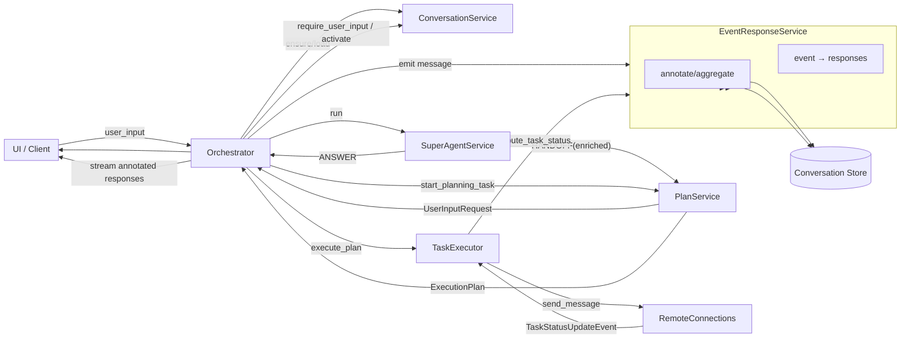
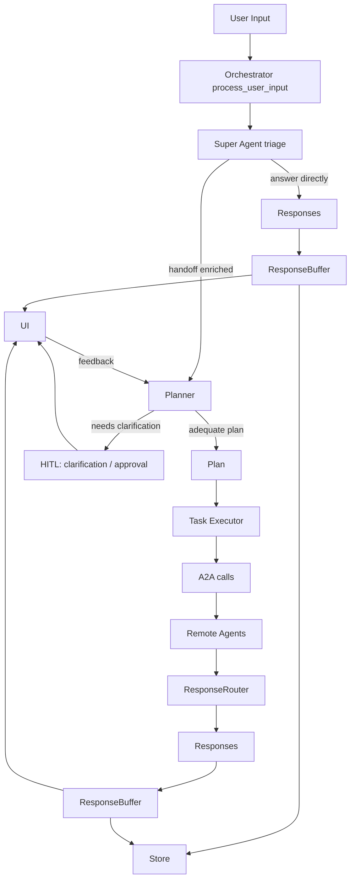
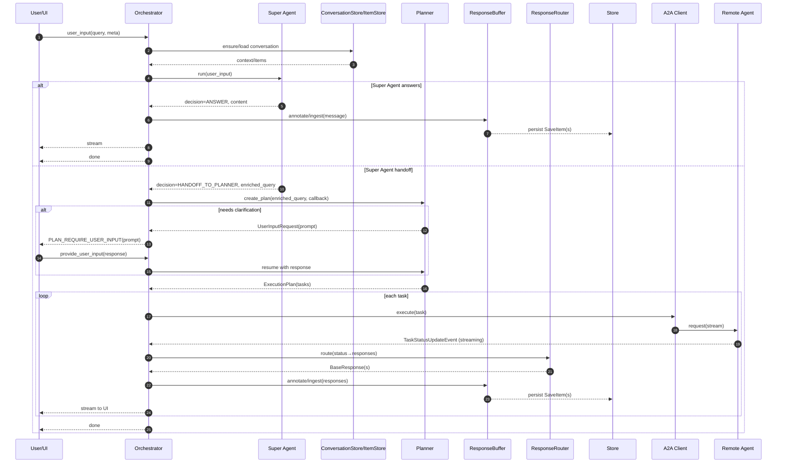

# ValueCell Core Architecture

This document explains how the modules under `valuecell/core/` collaborate at runtime.

## Highlights

- Super Agent triage ahead of planning: a lightweight "Super Agent" analyzes the user input first and either answers directly or hands off an enriched query to the planner.
- Async, re-entrant orchestrator: `process_user_input` streams responses and now runs planning/execution in a background producer so long-running work continues even if the client disconnects.
- Planner with HITL: pauses on missing info/risky steps via `UserInputRequest`, resumes after user feedback to produce an adequate plan.
- Streaming pipeline: A2A status events → `ResponseRouter` (map to BaseResponse) → `ResponseBuffer` (annotate/aggregate) → persisted to Store and streamed to UI, with stable item IDs for partial aggregation.
- Agent2Agent (A2A) integration: tasks call remote agents via `a2a-sdk`; status events drive routing; agents can be wrapped by lightweight decorators/servers.
- Conversation memory: in-memory/SQLite stores enable reproducible history, fast "resume from last", and auditability.
- Robustness: typed errors, side-effects (e.g., fail task) from router, and room for retry/backoff policies where appropriate.

## Services interaction overview

The diagram below focuses on how the orchestrator collaborates with the core services. It reflects the current code structure under `coordinate/`, `super_agent/`, `plan/`, `task/`, `event/`, and `conversation/`.

Key points:

- Orchestrator is the hub: it calls SuperAgentService, PlanService, TaskExecutor, and uses ConversationService to manage statuses.
- EventResponseService performs two roles:
  - Routing: maps remote task status events to typed BaseResponses via ResponseRouter.
  - Buffering & persistence: annotates with stable item IDs via ResponseBuffer and writes to the conversation store.
- Super Agent can short-circuit with a direct answer; otherwise it hands off an enriched query to the planner.

## High-level flow

The orchestration loop ingests a user input, lets the Super Agent triage and possibly answer or enrich the request, then plans next steps (with HITL when needed) and executes tasks via remote agents (A2A). Responses stream back incrementally and are routed to the appropriate sinks (UI, logs, stores).

### Sequence: async and reentrancy

## Orchestrator: process_user_input

The orchestrator entrypoint (`coordinate/orchestrator.py::AgentOrchestrator.process_user_input`) receives a user message (plus context IDs) and coordinates the entire lifecycle:

1. Delegate to the Super Agent to triage the request: directly answer simple queries or enrich the query and hand off to planning
2. Run the Planner to derive an actionable plan; if the plan needs confirmation or extra parameters, trigger Human-in-the-Loop (HITL)
3. Execute the plan via the Task Executor
4. Stream partial responses while executing
5. Persist results and emit final responses

The orchestrator is async and re-entrant, and now decouples producers/consumers:

- All I/O boundaries (`await`) are explicit to support concurrency
- A background producer continues planning/execution even if the client disconnects; the async generator simply drains a per-call queue
- If a human confirmation is required, the orchestrator can pause, surface a checkpoint, and resume later when feedback arrives
- Reentrancy is supported by idempotent response buffering and conversation state: resuming continues from the last acknowledged step

### Streaming model

Responses are produced incrementally while tasks execute:

- Remote agent status events are first mapped by `ResponseRouter` into typed `Response` objects (message chunks, reasoning, tool results, components)
- `ResponseBuffer` annotates with stable item IDs and aggregates partials, and `EventResponseService` persists them to the conversation store
- The orchestrator streams the annotated responses to the UI; persistence and streaming are decoupled from the client connection

This allows the UI to render partial progress while long-running steps (such as remote agent calls) are still in flight.

## Super Agent: triage before planning

The Super Agent performs a quick, tool-augmented triage of the user input to decide whether it can answer directly or should hand off to the planner.

Responsibilities:

- Detect simple Q&A or retrieval-style requests that can be answered immediately
- Optionally enrich/normalize the query and provide a concise restatement for planning
- Record minimal rationale for auditability

Under the hood:

- `super_agent/core.py` defines the `SuperAgent`, decision schema (`SuperAgentOutcome`) and tool wiring
- `super_agent/prompts.py` contains the instruction and expected output schema
- `super_agent/service.py` exposes a simple façade used by the orchestrator

If the decision is ANSWER, the orchestrator streams the content and returns. If the decision is HANDOFF_TO_PLANNER, the enriched query is passed to the planner.

## Planner: intent → plan (with HITL)

The Planner turns a natural-language user input (often enriched by the Super Agent) into an executable plan. Its responsibilities include:

- Interpreting the user’s goal and available agent capabilities
- Identifying missing parameters and ambiguities
- Producing a typed plan describing the steps and tool/agent calls

Human-in-the-loop is integrated into planning:

- When the planner detects insufficient information or risky actions, it emits a “clarification/approval” checkpoint
- The orchestrator surfaces that checkpoint via the router to the UI/user
- Once the user adds information or approves the step, the orchestrator resumes with an updated plan context

Under the hood:

- `plan/planner.py` encapsulates the decision logic (`ExecutionPlanner` and `UserInputRequest`)
- `plan/prompts.py` centralizes prompt templates (when LLM-based planning is used)
- `plan/models.py` defines plan/step data models, consumed by the orchestrator and executor
- `plan/service.py` manages the planner lifecycle and the pending user-input registry

## Task execution

After planning, the Task Executor runs each task. A task is an atomic unit that typically invokes a remote agent to perform work. Scheduled tasks are supported and can re-run according to their schedule; streaming output is accumulated and summarized for schedule results.

Execution characteristics:

- Tasks are awaited asynchronously; independent tasks may run concurrently when safe
- Each task emits structured responses (tool results, logs, progress) as it runs
- Failures are converted into typed errors and can trigger retries or compensating steps (policy-dependent)
- When the Super Agent hands off to a specific sub-agent, start/end components are emitted to mark that sub-agent conversation window

Under the hood:

- `task/executor.py` streams execution, integrates scheduled task accumulation, and routes A2A events through the response service
- `task/service.py` persists and transitions task state; `task/models.py` define the task’s shape

The conversation and item stores record inputs/outputs for reproducibility and auditing.

## A2A integration: talking to remote agents

Each task uses the Agent2Agent (A2A) protocol to interact with remote agents:

- Request/response schemas are defined by the agent capability “cards” and message models
- The local runtime uses `a2a-sdk` to send/receive over the selected transport (HTTP or others)
- Streaming results are fed into `ResponseBuffer` and routed live to clients

This protocol boundary makes agents location-transparent: they can run locally, remotely, or be swapped without changing the orchestrator.

## Agent implementation: decorators and wiring

Remote agents can be embedded with a very small footprint using the core agent decorator and wiring utilities:

- `agent/decorator.py` wraps a plain async function into a fully-typed agent handler
- `agent/connect.py` wires the decorated function into the runtime (registration, routing)
- `agent/card.py` describes capabilities, inputs, and outputs so the planner can select it

The planner can select this capability when it fits the user’s goal, and the orchestrator will route a task through A2A to execute it.

## Conversation and memory

`conversation_store.py` and `item_store.py` abstract conversation history and per-item storage:

- In-memory and SQLite backends are available
- Filtering and pagination support efficient context retrieval
- Latest items can be fetched for fast “resume from last” behaviors

This memory layer underpins reentrancy and auditability.

## Async & reentrancy details

- All external calls (super-agent triage, planning, remote agents, storage) are awaited
- A background producer runs independently of the client connection; consumers can cancel without stopping execution
- `ResponseBuffer` enables idempotent aggregation of partial output so a resumed session can safely replay or continue
- Orchestrator checkpoints (HITL) are modeled as explicit yield points; upon resumption, the same context IDs lead the flow to continue from the next step
- Execution contexts support validation (user consistency, TTL) and cleanup of expired sessions
- Backpressure: routers can apply flow control when sinks are slow

## Error handling & resilience

Typical edge cases and policies:

- Missing parameters → HITL clarification
- Super Agent errors → surfaced as structured failures; fallback to planner handoff can be policy-defined
- Planner errors → structured failure with user-facing guidance
- Agent timeouts → retry/backoff policies; partial results remain in the buffer
- Transport errors → surfaced via typed exceptions; orchestration may retry or abort
- Invalid or expired execution contexts → cancelled safely with user-facing messages
- Consistency → conversation records ensure inputs/outputs are durable

## Extensibility

- Add a new agent: create a capability card, implement a decorated async handler, register/connect it
- Add a new store: implement the `ItemStore`/`ConversationStore` interfaces
- Add a new transport: integrate a compatible adapter and update the A2A client wiring
- Customize the Super Agent: adjust prompts/decision logic or tools; control when to answer vs handoff
- Customize planning: extend planner prompts/logic and enrich plan models

---

In short, the orchestrator coordinates an async, re-entrant loop of triage → plan → execute → stream, with human checkpoints where appropriate. The Super Agent can answer or enrich before planning, tasks talk A2A to remote agents, and the response pipeline keeps users informed in real time while maintaining durable, reproducible state.
